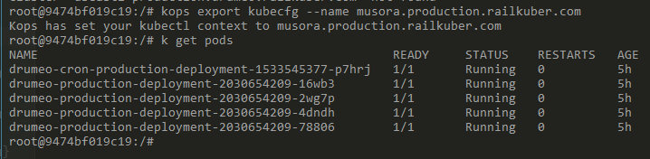

Website Offline
=

Initial Steps
-

Our production server runs on kubernetes in the aws US East Ohio region. We have 1 master node, 3 application nodes. We have 3 main application pods and 1 cron/job pod.

1.  First make sure you have the latest railkubernetes git, do a pull

1.  Once its pulled make sure you rebuild the docker image: `docker-compose up -d - -build` (you may need to manually delete the old docker image if you get build errors)
1.  Now exec in to the railkubernetes container, this is where all server management happens
1.  First make sure your kubectl is set to the production cluster (we have a production and staging cluster) `kops export kubecfg - -name musora.production.railkuber.com`
1.  Then run `kubectl get pods`
1.  If everything is running properly you should see something like the following when you run `kubectl get pods`

Finding the Problem
-

1. If you see anything other than 'Running' under status for a pod, that means its down or having problems

What to do first
-
1. Try re-deploying

1. If that doesnt work, try deleting all the pods so they automatically rebuild (this will cause downtime) `kubectl delete pods --all`
1. Wait for the pods to rebuild and see if its fixed

Check the Pod Logs
-

1.  If a pod is in a bad state like: **ImagePullBackoff** you can view its events with: `kubectl desribe pod NAME` (example as per image above: `kubectl describe pod drumeo-production-deployment-2030654209-78806`)

1. The events at the bottom of that dump should give you useful information
